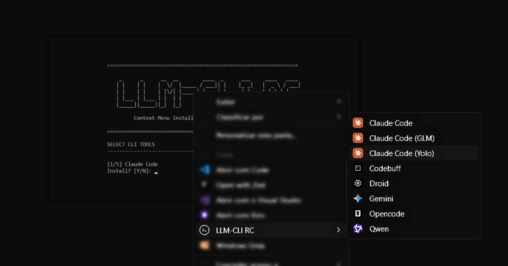

# LLM-CLI RC Context Menu

A Windows context menu integration for popular LLM command-line tools. Right-click on any folder to quickly launch your favorite AI assistants.




[](https://buymeacoffee.com/avenca.digital)

---

## Features

- **One-click access** to multiple LLM CLIs from Windows Explorer
- **Supported tools:**
  - [Claude Code](https://github.com/anthropics/claude-code) - Anthropic's CLI for Claude
  - [GLM - (Claude Code)](https://z.ai/subscribe?ic=DLZMYQBGJY) - Claude Code using GLM API (glm-4.7)
  - [Gemini CLI](https://github.com/google-gemini/gemini-cli) - Google's Gemini CLI
  - [Qwen](https://github.com/QwenLM/Qwen) - Alibaba's Qwen CLI
  - [Droid](https://factory.ai/) - Droid by Factory
  - [Opencode](https://github.com/anomalyco/opencode) - Open source AI coding assistant
  - [Codebuff](https://www.codebuff.com/referrals/ref-728535a5-2b61-4204-a7a7-d2af7c045bb9) - AI coding assistant CLI
  - [Kilo](https://kilo.ai/cli) - Kilo AI CLI
  - [Codex CLI](https://developers.openai.com/codex/cli/) - Codex CLI
- **Windows Terminal integration** - Opens in a new terminal tab
- **Custom icons** for each tool
- **Interactive installer** with configuration options

## Requirements

- Windows 10/11
- [Windows Terminal](https://aka.ms/terminal) installed
- The CLI tools you want to use must be installed and available in PATH

> **⚠️ Important:** This project **only installs the context menu integration**. It does **not** install the CLI tools themselves. You must install each CLI tool separately following their official documentation before using this menu.

## Installation

### Step 1: Install the CLI Tools

Before installing the context menu, make sure you have installed the CLI tools you want to use:

- **[Claude Code](https://github.com/anthropics/claude-code)** - Follow installation instructions in their repository
- **[Gemini CLI](https://github.com/google-gemini/gemini-cli)** - Check their documentation for setup
- **[Qwen](https://github.com/QwenLM/Qwen)** - See their official installation guide
- **[Droid](https://factory.ai/)** - Visit their website for installation steps
- **[Opencode](https://github.com/anomalyco/opencode)** - Follow their repository instructions
- **[Codebuff](https://www.codebuff.com/referrals/ref-728535a5-2b61-4204-a7a7-d2af7c045bb9)** - Visit their website for installation steps
- **[Codex CLI](https://developers.openai.com/codex/cli/)** - Visit their website for installation steps

Ensure the CLI tools are available in your system PATH by testing them in a terminal (e.g., `claude`, `gemini`, `qwen`, `droid`, `opencode`, `codebuff`, `kilo`, `codex`).

#### Quick Install Reference

| Tool | Install Command |
|------|-----------------|
| Claude Code (PowerShell) | `irm https://claude.ai/install.ps1 \| iex` |
| Claude Code (CMD) | `curl -fsSL https://claude.ai/install.cmd -o install.cmd && install.cmd && del install.cmd` |
| GLM (Claude Code) | Same as Claude Code |
| Gemini CLI | `npm install -g @google/gemini-cli` |
| Qwen | `npm install -g @qwen-code/qwen-code@latest` |
| Droid | `npm install -g droid` |
| Opencode | `npm install -g opencode-ai` |
| Codebuff | `npm install -g codebuff` |
| Kilo | `npm install -g @kilocode/cli` |
| Codex CLI | `npm i -g @openai/codex` |

> **Note:** Installation commands may vary. Always refer to the official documentation for the most up-to-date installation instructions.

### Step 2: Install the Context Menu

1. Clone or download this repository
2. Run `install.bat`
3. Follow the interactive prompts

### Installation Options

During installation, you'll be asked to select which **context menu entries** to add:

1. **[Claude Code](https://github.com/anthropics/claude-code)** - Adds two menu options:
   - **Claude Code** - Safe mode with permission prompts
   - **Claude Code (Yolo)** - Skips all permission prompts (use with caution)
2. **[GLM - (Claude Code)](https://z.ai/subscribe?ic=DLZMYQBGJY)** - Runs Claude Code using a GLM-compatible API (you'll be prompted for credentials during install — see [GLM Configuration](#glm-configuration))
3. **[Gemini CLI](https://github.com/google-gemini/gemini-cli)** - Google's Gemini CLI
4. **[Qwen](https://github.com/QwenLM/Qwen)** - Alibaba's Qwen CLI
5. **[Droid](https://factory.ai/)** - AI coding assistant
6. **[Opencode](https://github.com/anomalyco/opencode)** - Open source AI coding assistant
7. **[Codebuff](https://codebuff.com)** - AI coding assistant CLI
8. **[Kilo](https://kilo.ai/cli)** - Kilo AI CLI
9. **[Codex CLI](https://developers.openai.com/codex/cli/)** - Codex CLI

You can select any combination of tools - only the selected ones will appear in the context menu.

**Remember:** Install the actual CLI tools first by visiting their respective documentation pages (linked above).

## Usage

After installation:

1. Right-click on any **folder** in Windows Explorer
2. Select **"LLM-CLI RC"** from the context menu
3. Choose your preferred AI assistant

You can also right-click on an **empty area** inside any folder to get the same menu.

## Uninstallation

Run `uninstall.bat` to:

- Remove all registry entries
- Delete the `%USERPROFILE%\.llm-cli` folder and its contents

> **Note:** Uninstallation does not require administrator privileges.

## File Structure

```
.
├── install.bat           # Interactive installer script
├── uninstall.bat         # Uninstaller script
├── assets/               # Icon files
│   ├── cli.ico           # Main menu icon
│   ├── claude.ico        # Claude Code icon
│   ├── claudeglm.ico    # Claude Code (GLM) icon
│   ├── gemini.ico        # Gemini CLI icon
│   ├── qwen.ico          # Qwen icon
│   ├── droid.ico         # Droid icon
│   ├── opencode.ico      # Opencode icon
│   ├── codebuff.ico      # Codebuff icon
│   ├── kilo.ico          # Kilo icon
│   └── codex.ico         # Codex CLI icon
├── registry/             # Registry files
│   └── LLM_CLI_REMOVER.reg
└── README.md             # This file
```

## Configuration

The installer creates files in `%USERPROFILE%\.llm-cli\`:

- `assets/` - Copied icon files
- `claude-glm.cmd` - Generated script with GLM credentials (only if GLM is selected)

> **Note:** Installation does not require administrator privileges. Registry entries are created in user scope (`HKEY_CURRENT_USER`).

### GLM Configuration

When you select **Claude Code (GLM)** during installation, the installer will prompt you for:

| Parameter | Description | Default |
|-----------|-------------|---------|
| **API Token** | Your GLM API authentication token | *(required)* |
| **Base URL** | The GLM-compatible API endpoint | `https://api.z.ai/api/anthropic` |
| **Model** | The model name to use | `glm-4.7` |
| **Timeout** | Request timeout in milliseconds | `3000000` |

These values are stored locally in `%USERPROFILE%\.llm-cli\claude-glm.cmd` and are **never committed to the repository**. Each user provides their own credentials during installation.

To update your GLM credentials, simply re-run `install.bat` and select the GLM option again.

### Editing the GLM Script Manually

You can also edit the generated file directly at `%USERPROFILE%\.llm-cli\claude-glm.cmd` without re-running the installer. This is useful for:

- Changing the **API Key** (`ANTHROPIC_AUTH_TOKEN`)
- Switching the **model** (`ANTHROPIC_DEFAULT_OPUS_MODEL`, `ANTHROPIC_DEFAULT_HAIKU_MODEL`, `ANTHROPIC_DEFAULT_SONNET_MODEL`)
- Changing the **Base URL** or **Timeout**
- Adding **extra environment variables** for Claude Code features

The default generated file looks like this:

```bat
@echo off
set ANTHROPIC_AUTH_TOKEN=your-api-token
set ANTHROPIC_BASE_URL=https://api.z.ai/api/anthropic
set API_TIMEOUT_MS=3000000
set ANTHROPIC_DEFAULT_OPUS_MODEL=glm-4.7
set ANTHROPIC_DEFAULT_HAIKU_MODEL=glm-4.7
set ANTHROPIC_DEFAULT_SONNET_MODEL=glm-4.7
claude
```

You can add any additional `set` lines before the `claude` command to enable experimental features or pass custom configuration. For example, to enable Agent Teams:

```bat
@echo off
set ANTHROPIC_AUTH_TOKEN=your-api-token
set ANTHROPIC_BASE_URL=https://api.z.ai/api/anthropic
set API_TIMEOUT_MS=3000000
set ANTHROPIC_DEFAULT_OPUS_MODEL=glm-4.7
set ANTHROPIC_DEFAULT_HAIKU_MODEL=glm-4.7
set ANTHROPIC_DEFAULT_SONNET_MODEL=glm-4.7
set CLAUDE_CODE_EXPERIMENTAL_AGENT_TEAMS=1
claude
```

Any environment variable supported by Claude Code can be added this way. Changes take effect the next time you launch Claude Code (GLM) from the context menu.

## Security Note

The **Claude Code (Yolo)** option uses `--dangerously-skip-permissions` which bypasses all permission prompts. While convenient, this means Claude can:

- Read/write files without asking
- Execute commands without confirmation
- Make changes to your system

**Only use Yolo mode in trusted environments and projects you control.**

## Troubleshooting

### Context menu not appearing

- Try restarting Windows Explorer or logging out/in
- Check if registry entries exist in `HKEY_CURRENT_USER\Software\Classes\Directory\shell\LLMCLI`

### "wt.exe not found"

- Install [Windows Terminal](https://aka.ms/terminal) from the Microsoft Store

### CLI not found when launching

This context menu installer does **not** install the CLI tools themselves. If you get a "command not found" error:

- Install the CLI tool by following its official documentation (see Installation section)
- Ensure the CLI tool is available in your system PATH
- Test by running the CLI command directly in a terminal first (e.g., `claude --version`)

## License

MIT License

## Contributing

Contributions are welcome! Feel free to:

- Add support for more LLM CLIs
- Improve the installer
- Add new features

---

<a href="https://buymeacoffee.com/avenca.digital" target="_blank"></a>
